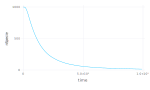
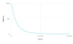
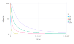
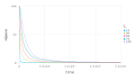
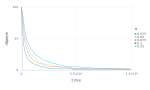
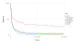
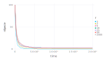
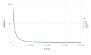

# Biological Model Examples
Here it's presented some tests of the model use

## Simple Examples
##### Test similar to the original model, multiple resource. The source file is presented in 'standart1.csv'. (model needs fix)
```C
## PARAMETERS VALUE ##
## LATTICESIZE = 500, NSPECIE = 1000, NRESOURCE = 3, DEATHPROB = 0.1, MUTATIONPROB = 0,
## NRESOURCEDIST = 250000, MAXTIME = 1000000, TIMEINTERVAL = 10000, NRUN = 50
```


##### Test similar to the original model, uniform resource. The source file is presented in 'standart2.csv'. (model needs fix)
```C
## PARAMETERS VALUE ##
## LATTICESIZE = 500, NSPECIE = 1000, NRESOURCE = 3, DEATHPROB = 0.1, MUTATIONPROB = 0, NRESOURCEDIST = 1,
## MAXTIME = 1000000, TIMEINTERVAL = 10000, NRUN = 10
```


## Parameter Variation
##### LATTICESIZE variation (multiple resource LATTICESIZE^2).
```C
## PARAMETERS VALUE ##
## NSPECIE = 100, NRESOURCE = 3, DEATHPROB = 0.1, MUTATIONPROB = 0, MAXTIME = 100000, TIMEINTERVAL = 1000,
## NRUN = 10
```


##### LATTICESIZE variation (fix 10 resource).
```C
## PARAMETERS VALUE ##
## NSPECIE = 100, NRESOURCE = 3, DEATHPROB = 0.1, MUTATIONPROB = 0, NRESOURCEDIST = 10, MAXTIME = 100000,
## TIMEINTERVAL = 1000, NRUN = 10
```


##### DEATHPROB variation.
```C
## PARAMETERS VALUE ##
## LATTICESIZE = 50, NSPECIE = 100, NRESOURCE = 3, MUTATIONPROB = 0, NRESOURCEDIST = 2500, MAXTIME = 100000,
## TIMEINTERVAL = 1000, NRUN = 10
```


##### MUTATIONPROB variation.
```C
## PARAMETERS VALUE ##
## LATTICESIZE = 50, NSPECIE = 100, NRESOURCE = 3, DEATHPROB = 0.1, NRESOURCEDIST = 2500, MAXTIME = 100000,
## TIMEINTERVAL = 1000, NRUN = 10
```


##### NRESOURCEDIST variation.
```C
## PARAMETERS VALUE ##
## LATTICESIZE = 50, NSPECIE = 100, NRESOURCE = 3, DEATHPROB = 0.1, MUTATIONPROB = 0, MAXTIME = 100000,
## TIMEINTERVAL = 1000, NRUN = 10
```


##### NSPECIE variation.
```C
## PARAMETERS VALUE ##
## LATTICESIZE = 50, NRESOURCE = 3, DEATHPROB = 0.1, MUTATIONPROB = 0, NRESOURCEDIST = 2500,
## MAXTIME = 100000, TIMEINTERVAL = 1000, NRUN = 10
```


##### Standart Plot
```C
## LATTICESIZE = 50, NSPECIE = 100, NRESOURCE = 3, DEATHPROB = 0.1, MUTATIONPROB = 0
## NRESOURCEDIST = 10, MAXTIME = 10000, TIMEINTERVAL = 100
```
Click <a href="Runplot.mp4" download>here</a> to download a video of an execution of the program.
