# Main metrics of the Model
Here it is presented some (preliminar) results of the model. The brute data generated by the model will be attached to each plot (in this file it is also presented the set of parameters that generate this file).


## Simple Example
#### Standard result (random network, uniform resources, alpha=0.5)

Evolution of the total number of varieties in the system and the mean number of varieties ([data](csv/1540586441_standard.csv)).
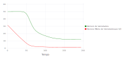

Phase diagram of the same two metrics ([data](csv/1540586441_standard.csv)).

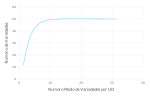

Histogram of the appearence and fitness at the end of the program ([data](csv/1540586441_histogramFitness.csv)).


Histogram of the number of varieties per DU, at the end of the program ([data](csv/1540586441_varietyDistribution.csv)).
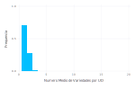

#### Plot example
Gif with one run of the model, elaborated using the same parameters of the standard case. This data is under the 1540586547 tag.

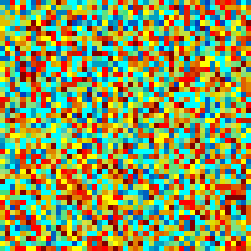


## Parameters variation
Now it will be presented the variation of 8 parameters, the outsideTradeLimit, the insideTradeLimit, the latticeSize, the number of resouces (habitats), the initial number of varieties, the alpha, the network type, and the probabilityNewVar. In all this results, if the considered parameter don't vary the standard resault will be as bellow.
```C
## PARAMETERS VALUE ###
## LATTICESIZE = 49, NVARIETY = 50, NRESOURCE = 3, NRESOURCEDIST = 1, NETWORKTYPE = 1,
## PROBABILITYCONNECTION = 0.15 KWT = 4, BETAWT = 0.2, MSF = 2, OUTSIDETRADELIMIT = 0.02,
## INSIDETRADELIMIT = 0.001, ALPHA = 0.5, NDOMESTICUNITY = 49, PROBABILITYNEWVAR = 0.0001,
## MAXTIME = 200, TIMEINTERVAL = 5, NRUN = 500
```

### alpha variation  

Evolution of the total number of varieties in the system ([data](csv/1540500312_varParam_a.csv)).
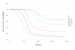

Phase diagram of the total number of varieties in the system and the mean number of varieties ([data](csv/1540500312_varParam_a.csv)).
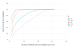

Histogram of the fitness at the end of the program ([data](csv/1540500312_histogramFitnessVar_a.csv)).
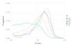

Histogram of the appearence at the end of the program ([data](csv/1540500312_histogramFitnessVar_a.csv)).
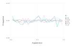

Histogram of the number of varieties per DU, at the end of the program ([data](csv/1540500312_varietyDistribution_a.csv)).
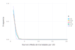

### networkType variation  

Evolution of the total number of varieties in the system ([data](csv/1540502167_varParam_n.csv)).
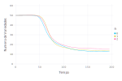

Phase diagram of the total number of varieties in the system and the mean number of varieties ([data](csv/1540502167_varParam_n.csv)).
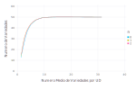

Histogram of the fitness at the end of the program ([data](csv/1540502167_histogramFitnessVar_n.csv)).
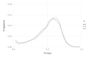

Histogram of the appearence at the end of the program ([data](csv/1540502167_histogramFitnessVar_n.csv)).
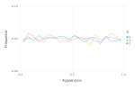

Histogram of the number of varieties per DU, at the end of the program ([data](csv/1540502167_varietyDistribution_n.csv)).
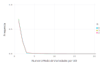

### outsideTradeLimit variation  

Evolution of the total number of varieties in the system ([data](csv/1540501784_varParam_o.csv)).
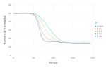

Phase diagram of the total number of varieties in the system and the mean number of varieties ([data](csv/1540501784_varParam_o.csv)).
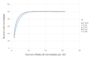

Histogram of the fitness at the end of the program ([data](csv/1540501784_histogramFitnessVar_o.csv)).
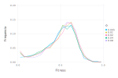

Histogram of the appearence at the end of the program ([data](csv/1540501784_histogramFitnessVar_o.csv)).
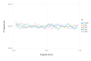

Histogram of the number of varieties per DU, at the end of the program ([data](csv/1540501784_varietyDistribution_o.csv)).
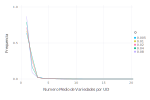

### insideTradeLimit variation  

Evolution of the total number of varieties in the system ([data](csv/1540501390_varParam_i.csv)).
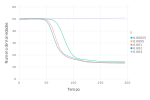

Phase diagram of the total number of varieties in the system and the mean number of varieties ([data](csv/1540501390_varParam_i.csv)).
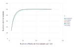

Histogram of the fitness at the end of the program ([data](csv/1540501390_histogramFitnessVar_i.csv)).
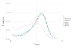

Histogram of the appearence at the end of the program ([data](csv/1540501390_histogramFitnessVar_i.csv)).
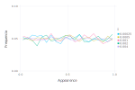

Histogram of the number of varieties per DU, at the end of the program ([data](csv/1540501390_varietyDistribution_i.csv)).
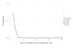

### latticeSize variation  

Evolution of the total number of varieties in the system ([data](csv/1540502861_varParam_L.csv)).


Phase diagram of the total number of varieties in the system and the mean number of varieties ([data](csv/1540502861_varParam_L.csv)).
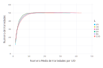

Histogram of the fitness at the end of the program ([data](csv/1540502861_histogramFitnessVar_L.csv)).
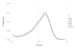

Histogram of the appearence at the end of the program ([data](csv/1540502861_histogramFitnessVar_L.csv)).
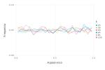

Histogram of the number of varieties per DU, at the end of the program ([data](csv/1540502861_varietyDistribution_L.csv)).
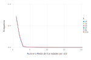

### numberInitialVariety variation  

Evolution of the total number of varieties in the system ([data](csv/1540501011_varParam_v.csv)).
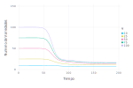

Phase diagram of the total number of varieties in the system and the mean number of varieties ([data](csv/1540501011_varParam_v.csv)).
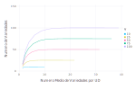

Histogram of the fitness at the end of the program ([data](csv/1540501011_histogramFitnessVar_v.csv)).
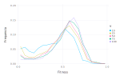

Histogram of the appearence at the end of the program ([data](csv/1540501011_histogramFitnessVar_v.csv)).
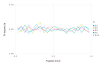

Histogram of the number of varieties per DU, at the end of the program ([data](csv/1540501011_varietyDistribution_v.csv)).
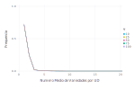

### numberHabitat variation  

Evolution of the total number of varieties in the system ([data](csv/1540500693_varParam_r.csv)).
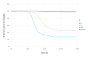

Phase diagram of the total number of varieties in the system and the mean number of varieties ([data](csv/1540500693_varParam_r.csv)).
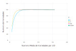

Histogram of the fitness at the end of the program ([data](csv/1540500693_histogramFitnessVar_r.csv)).
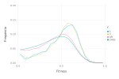

Histogram of the appearence at the end of the program ([data](csv/1540500693_histogramFitnessVar_r.csv)).
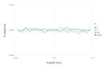

Histogram of the number of varieties per DU, at the end of the program ([data](csv/1540500693_varietyDistribution_r.csv)).
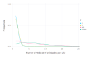

### probabilityNewVar variation  

Evolution of the total number of varieties in the system ([data](csv/1540502397_varParam_p.csv)).
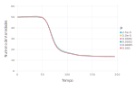

Phase diagram of the total number of varieties in the system and the mean number of varieties ([data](csv/1540502397_varParam_p.csv)).
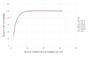

Histogram of the fitness at the end of the program ([data](csv/1540502397_histogramFitnessVar_p.csv)).
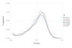

Histogram of the appearence at the end of the program ([data](csv/1540502397_histogramFitnessVar_p.csv)).
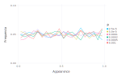

Histogram of the number of varieties per DU, at the end of the program ([data](csv/1540502397_varietyDistribution_p.csv)).
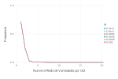

## Fixed points resulting from parameter variation

Now the parameters was varied and we took the final result from each run. The same standards parameters was used.

### alpha variation  

Phase diagram of the total number of varieties in the system and the mean number of varieties ([data](csv/1540503494_varParamFixedPoints_a.csv)).
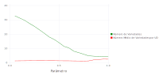

### networkType variation  

Phase diagram of the total number of varieties in the system and the mean number of varieties ([data](csv/1540508913_varParamFixedPoints_n.csv)).
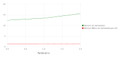

### outsideTradeLimit variation  

Phase diagram of the total number of varieties in the system and the mean number of varieties ([data](csv/1540507784_varParamFixedPoints_o.csv)).
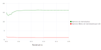

### insideTradeLimit variation  

Phase diagram of the total number of varieties in the system and the mean number of varieties ([data](csv/1540506768_varParamFixedPoints_i.csv)).
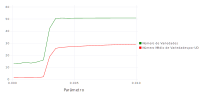

### latticeSize variation  

Phase diagram of the total number of varieties in the system and the mean number of varieties ([data](csv/1540509585_varParamFixedPoints_L.csv)).
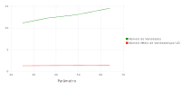

### numberInitialVariety variation  

Phase diagram of the total number of varieties in the system and the mean number of varieties ([data](csv/1540505280_varParamFixedPoints_v.csv)).
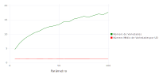

### numberHabitat variation  

Phase diagram of the total number of varieties in the system and the mean number of varieties ([data](csv/1540504973_varParamFixedPoints_r.csv)).
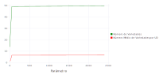

### probabilityNewVar variation  

Phase diagram of the total number of varieties in the system and the mean number of varieties ([data](csv/1540509134_varParamFixedPoints_p.csv)).

