# Main metrics of the Model
Here it is presented some (preliminar) results of the model. The brute data generated by the model will be attached to each plot (in this file it is also presented the set of parameters that generate this file).


## Simple Example
#### Standard result (random network, uniform resources, alpha=0.5)

Evolution of the total number of varieties in the system and the mean number of varieties ([data](csv/1545409355_standard.csv)).
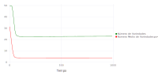

Phase diagram of the same two metrics ([data](csv/1545409355_standard.csv)).

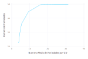

Histogram of the appearence and fitness at the end of the program ([data](csv/1545409355_histogramFitness.csv)).
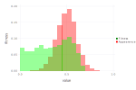

Histogram of the number of varieties per DU, at the end of the program ([data](csv/1545409355_varietyDistribution.csv)).
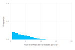

## Detailed data of one run

#### First example

Evolution of the total number of varieties in the system and the mean number of varieties ([data](csv/1545247586_standard.csv)).  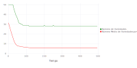

Diiference of external (left) and internal (right) punctuation for 5 choosen Domestic Unity ([data1](csv/1545247586_puncDifference1.csv), [data2](csv/1545247586_puncDifference2.csv)).
<p float="left">
  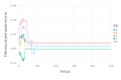
  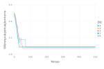
</p>

Bar plot of the external (left) and internal (right) trades in function of time ([data1](csv/1545247586_networkTradeTime1.csv), [data2](csv/1545247586_networkTradeTime2.csv)).
<p float="left">
  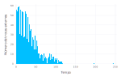
  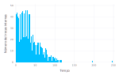
</p>

Gif with one run of the model.

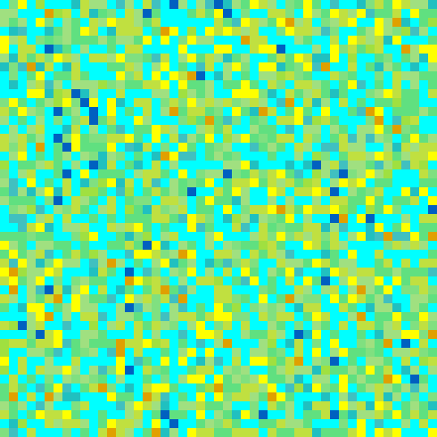

#### Second example

Evolution of the total number of varieties in the system and the mean number of varieties ([data](csv/1545249202_standard.csv)).  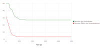

Diiference of external (left) and internal (right) punctuation for 5 choosen Domestic Unity ([data1](csv/1545249202_puncDifference1.csv), [data2](csv/1545249202_puncDifference2.csv)).
<p float="left">
  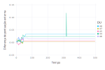
  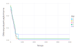
</p>

Bar plot of the external (left) and internal (right) trades in function of time ([data1](csv/1545249202_networkTradeTime1.csv), [data2](csv/1545249202_networkTradeTime2.csv)).
<p float="left">
  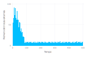
  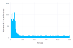
</p>

Gif with one run of the model.

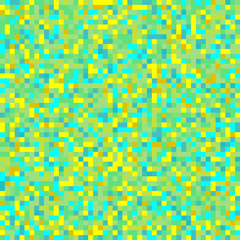


## Parameters variation
Now it will be presented the variation of 9 parameters, the outsideTradeLimit, the insideTradeLimit, the latticeSize, the number of resouces (habitats), the initial number of varieties, the alpha, the network type, the probabilityNewVar and the betaWT. In all this results, if the considered parameter don't vary the standard resault will be as bellow.
```C
## PARAMETERS VALUE ###
## LATTICESIZE = 49, NVARIETY = 50, NRESOURCE = 3, NRESOURCEDIST = 1, NETWORKTYPE = 1,
## PROBABILITYCONNECTION = 0.15 KWT = 4, BETAWT = 0.2, MSF = 2, OUTSIDETRADELIMIT = 0.01,
## INSIDETRADELIMIT = 0.05, ALPHA = 0.5, NDOMESTICUNITY = 49, PROBABILITYNEWVAR = 0.0001,
## MAXTIME = 1000, TIMEINTERVAL = 10, NRUN = 500
```

### alpha variation

Evolution of the total number of varieties in the system ([data](csv/1545297791_varParam_a.csv)).
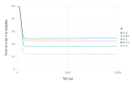

Evolution of the mean number of varieties per DU ([data](csv/1545297791_varParam_a.csv)).
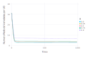

Histogram of the fitness at the end of the program ([data](csv/1545297791_histogramFitnessVar_a.csv)).
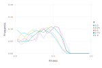

Histogram of the appearence at the end of the program ([data](csv/1545297791_histogramFitnessVar_a.csv)).
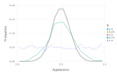

Histogram of the number of varieties per DU, at the end of the program ([data](csv/1545297791_varietyDistribution_a.csv)).
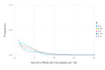

### networkType variation

Evolution of the total number of varieties in the system ([data](csv/1545299826_varParam_n.csv)).
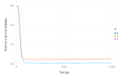

Evolution of the mean number of varieties per DU ([data](csv/1545299826_varParam_n.csv)).
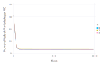

Histogram of the fitness at the end of the program ([data](csv/1545299826_histogramFitnessVar_n.csv)).
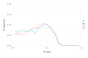

Histogram of the appearence at the end of the program ([data](csv/1545299826_histogramFitnessVar_n.csv)).
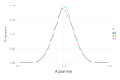

Histogram of the number of varieties per DU, at the end of the program ([data](csv/1545299826_varietyDistribution_n.csv)).
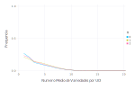

### outsideTradeLimit variation

Evolution of the total number of varieties in the system ([data](csv/1545299399_varParam_o.csv)).
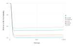

Evolution of the mean number of varieties per DU ([data](csv/1545299399_varParam_o.csv)).
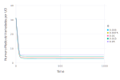

Histogram of the fitness at the end of the program ([data](csv/1545299399_histogramFitnessVar_o.csv)).
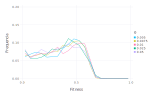

Histogram of the appearence at the end of the program ([data](csv/1545299399_histogramFitnessVar_o.csv)).
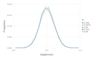

Histogram of the number of varieties per DU, at the end of the program ([data](csv/1545299399_varietyDistribution_o.csv)).
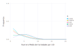

### insideTradeLimit variation

Evolution of the total number of varieties in the system ([data](csv/1545298968_varParam_i.csv)).
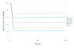

Evolution of the mean number of varieties per DU ([data](csv/1545298968_varParam_i.csv)).
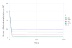

Histogram of the fitness at the end of the program ([data](csv/1545298968_histogramFitnessVar_i.csv)).


Histogram of the appearence at the end of the program ([data](csv/1545298968_histogramFitnessVar_i.csv)).
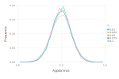

Histogram of the number of varieties per DU, at the end of the program ([data](csv/1545298968_varietyDistribution_i.csv)).
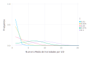

### latticeSize variation

Evolution of the total number of varieties in the system ([data](csv/1545300650_varParam_L.csv)).
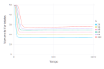

Evolution of the mean number of varieties per DU ([data](csv/1545300650_varParam_L.csv)).
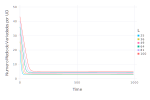

Histogram of the fitness at the end of the program ([data](csv/1545300650_histogramFitnessVar_L.csv)).
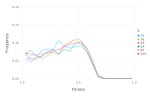

Histogram of the appearence at the end of the program ([data](csv/1545300650_histogramFitnessVar_L.csv)).
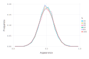

Histogram of the number of varieties per DU, at the end of the program ([data](csv/1545300650_varietyDistribution_L.csv)).
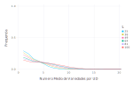

### numberInitialVariety variation

Evolution of the total number of varieties in the system ([data](csv/1545298579_varParam_v.csv)).
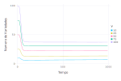

Evolution of the mean number of varieties per DU ([data](csv/1545298579_varParam_v.csv)).
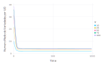

Histogram of the fitness at the end of the program ([data](csv/1545298579_histogramFitnessVar_v.csv)).
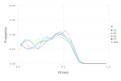

Histogram of the appearence at the end of the program ([data](csv/1545298579_histogramFitnessVar_v.csv)).
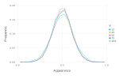

Histogram of the number of varieties per DU, at the end of the program ([data](csv/1545298579_varietyDistribution_v.csv)).
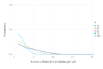

### numberHabitat variation

Evolution of the total number of varieties in the system ([data](csv/1545298189_varParam_r.csv)).
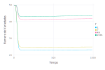

Evolution of the mean number of varieties per DU ([data](csv/1545298189_varParam_r.csv)).
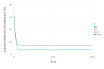

Histogram of the fitness at the end of the program ([data](csv/1545298189_histogramFitnessVar_r.csv)).
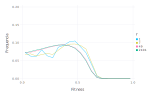

Histogram of the appearence at the end of the program ([data](csv/1545298189_histogramFitnessVar_r.csv)).
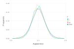

Histogram of the number of varieties per DU, at the end of the program ([data](csv/1545298189_varietyDistribution_r.csv)).
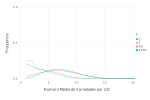

### probabilityNewVar variation

Evolution of the total number of varieties in the system ([data](csv/1545300061_varParam_p.csv)).


Evolution of the mean number of varieties per DU ([data](csv/1545300061_varParam_p.csv)).


Histogram of the fitness at the end of the program ([data](csv/1545300061_histogramFitnessVar_p.csv)).


Histogram of the appearence at the end of the program ([data](csv/1545300061_histogramFitnessVar_p.csv)).


Histogram of the number of varieties per DU, at the end of the program ([data](csv/1545300061_varietyDistribution_p.csv)).


### betaWT variation

Evolution of the total number of varieties in the system ([data](csv/1545300660_varParam_b.csv)).


Evolution of the mean number of varieties per DU ([data](csv/1545300660_varParam_b.csv)).


Histogram of the fitness at the end of the program ([data](csv/1545300660_histogramFitnessVar_b.csv)).


Histogram of the appearence at the end of the program ([data](csv/1545300660_histogramFitnessVar_b.csv)).


Histogram of the number of varieties per DU, at the end of the program ([data](csv/1545300660_varietyDistribution_b.csv)).


## Fixed points resulting from parameter variation

Now the parameters was varied and we took the final result from each run. The same standards parameters was used.

### alpha variation

Variation of the fixed points of the systems as the choosen parameter varies ([data](csv/1545301507_varParamFixedPoints_a.csv)).


### networkType variation

Variation of the fixed points of the systems as the choosen parameter varies ([data](csv/1545306849_varParamFixedPoints_n.csv)).


### outsideTradeLimit variation

Variation of the fixed points of the systems as the choosen parameter varies ([data](csv/1545306071_varParamFixedPoints_o.csv)).


### insideTradeLimit variation

Variation of the fixed points of the systems as the choosen parameter varies ([data](csv/1545305334_varParamFixedPoints_i.csv)).


### latticeSize variation

Variation of the fixed points of the systems as the choosen parameter varies ([data](csv/1545309038_varParamFixedPoints_L.csv)).


### numberInitialVariety variation

Variation of the fixed points of the systems as the choosen parameter varies ([data](csv/1545303757_varParamFixedPoints_v.csv)).


### numberHabitat variation

Variation of the fixed points of the systems as the choosen parameter varies ([data](csv/1545303363_varParamFixedPoints_r.csv)).


### probabilityNewVar variation

Variation of the fixed points of the systems as the choosen parameter varies ([data](csv/1545307115_varParamFixedPoints_p.csv)).


### betaWT variation

Variation of the fixed points of the systems as the choosen parameter varies ([data](csv/1545307885_varParamFixedPoints_b.csv)).


## Multiple Executions of the model

In this results, each 'm' value indicated one individual simulation of the model.

Evolution of the total number of varieties in the system ([data](csv/1545309353_varParam_m.csv)).


Evolution of the mean number of varieties per DU ([data](csv/1545309353_varParam_m.csv)).


Histogram of the fitness at the end of the program ([data](csv/1545309353_histogramFitnessVar_m.csv)).


Histogram of the appearence at the end of the program ([data](csv/1545309353_histogramFitnessVar_m.csv)).


Histogram of the number of varieties per DU, at the end of the program ([data](csv/1545309353_varietyDistribution_m.csv)).


