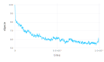
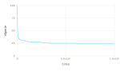
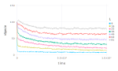
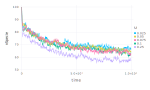
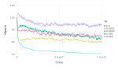
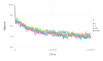
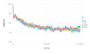

# Biological Model Examples
Here it's presented some tests of the model use.

## Simple Examples
##### Test with the standard model. The source file is presented in 'standard1.csv'.
```C
### PARAMETERS VALUE ###
### LATTICESIZE = 49, NSPECIE = 100, NRESOURCE = 3, DEATHPROB = 0.1, MUTATIONPROB = 0.001,
### NRESOURCEDIST = 49, NPROPRIETY = 49, MAXTIME = 10000, TIMEINTERVAL = 10, NRUN = 10
```


##### Another test with standard model, now with no mutation and increased MAXTIME. The source file is presented in 'standard2.csv'.
```C
### PARAMETERS VALUE ###
### LATTICESIZE = 49, NSPECIE = 100, NRESOURCE = 3, DEATHPROB = 0.1, MUTATIONPROB = 0,
### NRESOURCEDIST = 49, NPROPRIETY = 49, MAXTIME = 100000, TIMEINTERVAL = 100, NRUN = 10 ###
```


## Parameter Variation
##### LATTICESIZE variation (NRESOURCEDIST and NPROPRIETY set equal to actual LATTICESIZE).
```C
### PARAMETERS VALUE ###
### NSPECIE = 100, NRESOURCE = 3, DEATHPROB = 0.1, MUTATIONPROB = 0.001, MAXTIME = 10000,
### TIMEINTERVAL = 10, NRUN = 10
```


##### DEATHPROB variation.
```C
### PARAMETERS VALUE ###
### LATTICESIZE = 49, NSPECIE = 100, NRESOURCE = 3, MUTATIONPROB = 0.001, NRESOURCEDIST = 49,
### NPROPRIETY = 49, MAXTIME = 10000, TIMEINTERVAL = 10, NRUN = 10
```


##### MUTATIONPROB variation.
```C
### PARAMETERS VALUE ###
### LATTICESIZE = 49, NSPECIE = 100, NRESOURCE = 3, DEATHPROB = 0.1, MUTATIONPROB = 0.005,
### NRESOURCEDIST = 49, NPROPRIETY = 49, MAXTIME = 10000, TIMEINTERVAL = 10, NRUN = 10
```


##### NRESOURCEDIST variation.
```C
### PARAMETERS VALUE ###
### LATTICESIZE = 49, NSPECIE = 100, NRESOURCE = 3, DEATHPROB = 0.1, MUTATIONPROB = 0.001,
### NPROPRIETY = 49, MAXTIME = 10000, TIMEINTERVAL = 10, NRUN = 10
```


##### NSPECIE variation.
```C
### PARAMETERS VALUE ###
### LATTICESIZE = 49, NRESOURCE = 3, DEATHPROB = 0.1, MUTATIONPROB = 0.001,
### NRESOURCEDIST = 49, NPROPRIETY = 49, MAXTIME = 10000, TIMEINTERVAL = 10, NRUN = 10
```


##### standard Plot
```C
### PARAMETERS VALUE ###
### LATTICESIZE = 49, NSPECIE = 100, NRESOURCE = 3, DEATHPROB = 0.1, MUTATIONPROB = 0.001,
### NRESOURCEDIST = 49, NPROPRIETY = 49, MAXTIME = 10000, TIMEINTERVAL = 100
```
Click <a href="https://github.com/vitorhirata/project-agrobio/raw/master/social_model/examples/Runplot.avi" download> here </a> to download a video of an execution of the program.
